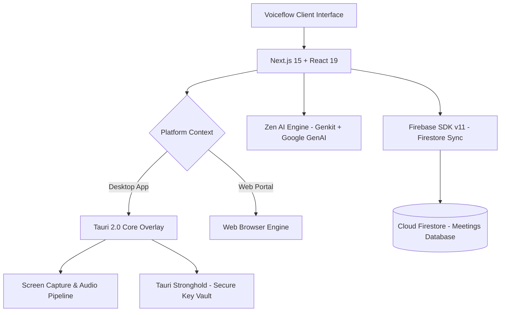

# 🌌 VOICEFLOW | Undetectable AI Meeting Notetaker & Real-Time Co-Pilot


Welcome to **Voiceflow**, an undetectable, real-time **AI Meeting Notetaker & Stealth Assistant** built for executive calls, technical interviews, and team syncs. Voiceflow runs live during your meetings (Zoom, Google Meet, Teams) to capture transcripts, summarize key takeaways, and provide real-time AI assistance via screen & audio analysis.

---

## 🚀 Key Platforms & Deployment Targets

1. **Desktop Workstation & Overlay (Windows/macOS)**
   * Built with **Tauri 2.0** and **Next.js 15** for native, ultra-lightweight performance and low-latency desktop windowing.
   * Runs a floating stealth widget overlay (`MeetingWidget`) that sits seamlessly on top of active call windows.

2. **Web Portal & Dashboard**
   * Access saved meeting transcripts, structured AI summaries, action item trackers, and custom knowledge bases from any browser.

---

## 🛠️ Technical Stack & Architecture

Voiceflow is built on a modern, robust, resilient stack:



### 1. Front-end Framework & Desktop Overlay
* **Next.js 15.5.9** (App Router, Turbopack, **React 19**) for high-performance UI rendering.
* **Tauri 2.0** (Rust-backed desktop framework) for transparent window overlays, low-footprint desktop execution, and system hotkeys.
* **Framer Motion** for smooth widget transitions and subtle micro-animations.

### 2. Live Audio Listening & Stealth Q&A
* **Real-time Screen & Transcript Analysis (`/api/ask-screen`)**: Captures screen contexts and pairs them with incoming transcript snippets to answer live prompts (*"What should I say next?"*, *"Fact check this"*).
* **Automated Meeting Notetaker**: Detects active call sessions and transcribes audio directly into structured summaries and action items.

### 3. Storage & AI Capabilities
* **Firebase Cloud Firestore**: Multi-tenant database for storing user meeting records (`meetings` and `meeting_checkins`).
* **Genkit v1.20.0 + Google GenAI**: Powers real-time AI model calls and structured meeting analytics.

---

## 🛡️ Core Capabilities & Modules

* **AI Meeting Notetaker**: Automated meeting listening, live transcription, meeting summaries, and action item extraction.
* **Stealth Co-Pilot Widget**: Undetectable overlay widget over Zoom, Meet, or Teams for discreet Q&A and prompt recommendations during calls.
* **Real-time Answers & Intelligence**: Centralized dashboard to view meeting histories and search through transcripts.

---

## ⚙️ Developer Setup & Installation

Follow these steps to set up and run Voiceflow in your local development environment:

### Prerequisites
* **Node.js**: v18.x or higher
* **Rust & Cargo** (Required for Tauri desktop builds): See [Tauri Prerequisites Guide](https://v2.tauri.app/start/prerequisites/)

### 1. Clone the Codebase
```bash
git clone https://github.com/I-m-a-m-4/voiceflow.git
cd voiceflow
```

### 2. Configure Environment Variables
Create a `.env.local` file in the root directory and specify your Firebase, Genkit, and API secrets:
```env
# Firebase Configuration
NEXT_PUBLIC_FIREBASE_API_KEY=your_api_key
NEXT_PUBLIC_FIREBASE_AUTH_DOMAIN=your_auth_domain
NEXT_PUBLIC_FIREBASE_PROJECT_ID=your_project_id
NEXT_PUBLIC_FIREBASE_STORAGE_BUCKET=your_storage_bucket
NEXT_PUBLIC_FIREBASE_MESSAGING_SENDER_ID=your_messaging_sender_id
NEXT_PUBLIC_FIREBASE_APP_ID=your_app_id

# Google Gemini AI Secret
GEMINI_API_KEY=your_gemini_api_key

# Email Dispatcher Configurations (Resend / Nodemailer)
RESEND_API_KEY=your_resend_api_key
```

### 3. Install Dependencies
Ensure package overrides are respected and apply necessary package patches:
```bash
npm install
```

### 4. Run Development Servers
* **Run Web Application (Next.js)**:
  ```bash
  npm run dev
  ```
  The NextJS portal will be accessible locally at `http://localhost:9007`.

* **Run Desktop Workstation (Tauri Dev Mode)**:
  ```bash
  npm run tauri dev
  ```
  This will launch the native Tauri desktop shell with hot-reloading active.

### 5. Build for Production
* **Compile Web/PWA distribution**:
  ```bash
  npm run build
  ```
* **Compile Native Desktop Executables (Windows/macOS/Linux)**:
  ```bash
  npm run tauri build
  ```

---

## 🔄 Git Branching & CI/CD Workflow
* **`main`**: Production-ready code. Releases are triggered automatically via GitHub Actions `.github/workflows/release.yml`.
* **Development Flow**: Create descriptive feature branches (e.g., `feature/pos-offline-sync`), perform rigorous typechecks (`npm run typecheck`), and verify code compliance before opening Pull Requests.

---

© 2026 Voiceflow POS & Retail OS. All Rights Reserved. Engineered for the future of borderless retail operations.
